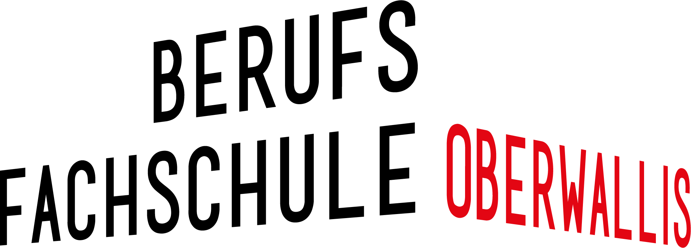

<h1 align="center">
  <br>
  
  <br>
  Minilabor Maze
  <br>
</h1>


<p align="center">
  <a href="#structure">Structure</a> •
  <a href="#usage">Usage</a> •
  <a href="#credits">Credits</a> •
  <a href="#find-us-on">Find us on</a>
</p>

Practical Minilabor for promote the HES-SO Valais Wallis Engineering School in Sion.

It is intended for the student from EPTM in Sion and BFO in Visp.

  
        

## Structure

```
+-- archive/                     # Eclipse project archive zip files ready to import
+-- code/                        # Source code of the project
|     +-- masterVersion          # Solution
|     +-- studentVersion         # Unfinished code
+-- docs/                        # Labor documentation in french and german
+-- img/                         # Useful logos and images
+-- .gitignore                   # Overall git ignore file
+-- README.md                    # This file
```

## Usage
* Install [Eclipse](https://www.eclipse.org/downloads)
* Import the either the student- or masterVersion archive
* Follow the instructions in [Project Maze German](docs/Projet MAZE-d.pdf) or [Project Maze French](docs/Projet MAZE-f.pdf)
* Have Fun

## Credits

* [Dr. Pierre-André Mudry](mailto:pierre-andre.mudry@hevs.ch)
* [Silvan Zahno](mailto:silvan.zahno@hevs.ch)

## Find us on

* Webpage [hevs.ch](https://www.hevs.ch)
* LinkedIn [HES-SO Valais-Wallis](https://www.linkedin.com/groups/104343/)
* Youtube [HES-SO Valais-Wallis](https://www.youtube.com/user/HESSOVS/)
* Twitter [@hessovalais](https://twitter.com/hessovalais)
* Facebook [@hessovalais](https://www.facebook.com/hessovalais)